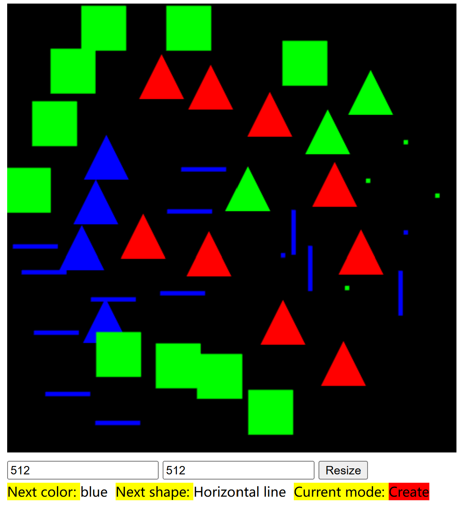
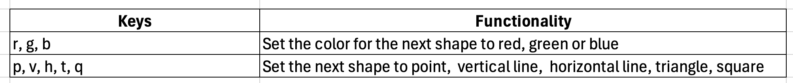

# RT_Rendering_Lab2

## How to launch
Open `main.html` with your browser.

Then, three `alert` are expected to pop out which indicate successful creation of `vertex`, `fragment` shaders and shader program.

After close those `alert`s, a black canvas will appear.

## Modes

There are two modes: `Create` and `Select`, Use `C` to switch between modes, and in both modes you can use `c` to clear the canvas.

### Create

In `Create` mode, you can specify the next shape and color you want to draw, with `left mouse click` on the canvas, you can add a new shape on the canvas.

### Select

In `Select` mode, you can:
* Pick any shapes (and any number of them) you have drawn, and change their color, and locally change their size and orientation.

    To do this, first `left mouse click` on any shapes you have drawn to pick them, the picked shape will have `a white outer line` showing they have been picked. Then:
    * use `S` and `s` to scale up and down them locally.
    * use `r`, `g`, `b` to change their color.
    * use `left mouse click & drag` upward and downward to rotate them in counter clockwise or clockwise locally.
    * use `Esc` to de-selected all shapes you have picked.

    
* Transform all shapes globally w.r.t the world origin

    To do this, first use `W` to enter the global transformation mode (use `w` to leave it), then, with `left mouse click & drag` upward and downward, you can rotate them in counter clockwise or clockwise globally.

## Bonus point attempted
1. Object selection, color change and scaling.

2. Customized matrix arithmetic.

## Software Info
Operating system: Windows 11

Web browser: Microsoft Edge